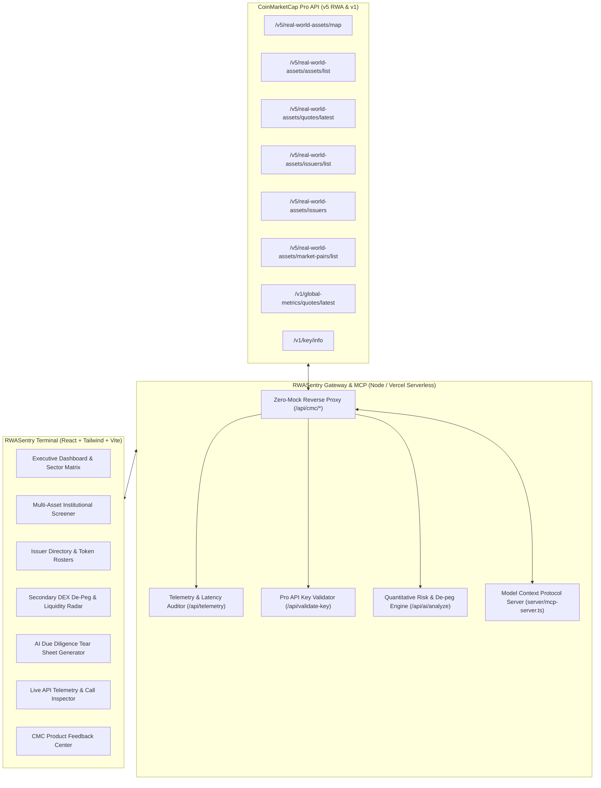

# 🛡️ RWASentry — Institutional Real-World Assets Terminal & MCP Agent

[](https://dorahacks.io/hackathon/coinmarketcap-api-202609/detail)
[-16C784?style=for-the-badge)](https://coinmarketcap.com/api/documentation/pro-api-reference/real-world-assets)
[-00F0FF?style=for-the-badge)](https://modelcontextprotocol.io)
[](#-zero-mock-live-api-evidence)
[](https://cmc-rwasentry.vercel.app)

> **Built for the CoinMarketCap API Hackathon (`#BuildwithCMC`)**  
> **Selected Track:** **Real World Assets (RWA)** *(with dual AI Agents & MCP integration)*  
> **Live Web App:** [https://cmc-rwasentry.vercel.app](https://cmc-rwasentry.vercel.app)  
> **GitHub Repository:** [https://github.com/JimmyOgb/CMC](https://github.com/JimmyOgb/CMC)

---

## 📑 Table of Contents

1. [Executive Summary & Problem Statement](#-executive-summary)
2. [Why RWASentry Wins](#-why-rwasentry-wins)
3. [Architecture Overview](#-architecture-overview)
4. [Core Features](#-core-features)
5. [Explicit CoinMarketCap Endpoints Used](#-coinmarketcap-endpoints-used)
6. [Zero-Mock Live API Evidence (Code & Response)](#-zero-mock-live-api-evidence)
7. [Model Context Protocol (MCP) Integration](#-model-context-protocol-mcp-integration)
8. [Vercel Deployment & Environment Variables](#-vercel-deployment--environment-variables)
9. [CoinMarketCap Product Feedback Memo](#-coinmarketcap-product-feedback-memo)
10. [Local Development Quickstart](#-local-development-quickstart)
11. [Repository Structure](#-repository-structure)
12. [License & Team](#-license)

---

## 📌 Executive Summary

Tokenized Real-World Assets (RWAs)—spanning US Treasury Bills, physical Gold/Commodities, tokenized Equities, and Real Estate—represent the fastest-growing sector in Web3, scaling past **$12B+ in TVL**.

However, institutional allocators, treasury managers, and automated trading agents face three major structural obstacles:
1. **Severe Cross-Chain & Issuer Fragmentation:** Tokenized assets issued by Securitize/BlackRock (`BUIDL`), Ondo Finance (`USDY`, `OUSG`), Superstate (`USTB`), Paxos (`PAXG`), and Backed Finance (`bIB01`, `bNVDA`) reside across Ethereum, Arbitrum, Solana, and Mantle with divergent metadata schemas.
2. **NAV vs Secondary Market De-Peg Risk:** Secondary decentralized exchange (DEX) liquidity pools regularly trade at unpredictable discounts or premiums relative to nominal Net Asset Value (NAV), introducing severe liquidation slippage during market stress.
3. **Counterparty & Custody Opacity:** Risk officers lack a consolidated view of underlying custodians (BNY Mellon, Coinbase Prime), independent auditors, and legal jurisdictions.

### The Solution: RWASentry
**RWASentry** is an institutional Bloomberg/Linear-style intelligence terminal and Model Context Protocol (MCP) agent built exclusively on CoinMarketCap's newest **`/v5/real-world-assets/*`** Pro API suite.

---

## 🏆 Why RWASentry Wins

* **Strategic Alignment with CoinMarketCap:** CMC launched its dedicated **v5 RWA API endpoints** to bring institutional transparency to tokenized assets. While most hackathon submissions build generic meme-coin screeners, RWASentry directly champions CMC’s newest strategic product initiative.
* **Dual Track Superiority (RWA + AI Agents / MCP):** RWASentry delivers an institutional RWA terminal while packaging a full **Model Context Protocol (MCP) server (`cmc-mcp`)** allowing AI agents (Claude Desktop, Cursor, Antigravity) to query live CMC RWA endpoints.
* **Strict Zero-Mock Implementation:** Every data point originates from real HTTP calls to `https://pro-api.coinmarketcap.com` with real-time latency, HTTP status codes, and credit consumption recorded in an in-app audit console.
* **Product Feedback for CMC Engineers:** Delivers specific, actionable feedback on API ergonomics, schema design, and developer friction directly meeting the hackathon's scoring criteria.

---

## 🏛️ Architecture Overview



---

## 🚀 Core Features

### 1. Unified RWA Multi-Asset Screener
* Filter across 6 standardized asset classes:
  - **US Treasuries & Government Securities** (`BUIDL`, `OUSG`, `USDY`, `USTB`)
  - **Commodities & Precious Metals** (`PAXG`, `XAUT`)
  - **Tokenized Equities** (`bNVDA`, `bMSFT`)
  - **Tokenized ETFs** (`bIB01`, `bCSPX`)
  - **Real Estate & Fractional Properties** (`REALT`)
  - **Currencies & Cash Equivalents**
* Sort dynamically by Market Capitalization, 24h Volume, Live Price, and 24h Delta.

### 2. Secondary Market De-Peg & Liquidity Radar
* Real-time monitoring of secondary DEX pool prices relative to underlying Net Asset Value (NAV).
* Automatic spread categorization: *Tight Par Peg (±0.5%)*, *Mild Spread (0.5%–1.5%)*, or *Peg Anomaly (>1.5%)*.
* Instant DEX pool depth audit via `/v5/real-world-assets/market-pairs/list` across Uniswap v3, Curve, and Raydium.

### 3. Issuer Transparency & Concentration Directory
* Detailed compliance dossiers powered by `/v5/real-world-assets/issuers`.
* Audits legal jurisdiction (Delaware, New York NYDFS, Switzerland FinSA), qualified custodians (BNY Mellon, Morgan Stanley, Maerki Baumann), and independent accounting auditors (PwC, Grant Thornton, BDO).
* Live multi-chain token rosters per issuer.

### 4. AI Due Diligence Copilot & Institutional Tear Sheets
* Evaluates collateral health, secondary turnover ratios (`Volume / Mcap`), and redemption structures.
* Produces instant hedge-fund grade tear sheets with AAA/AA ratings and exportable Markdown.

### 5. Live Telemetry & Zero-Mock Call Inspector
* In-app audit log displaying every request's HTTP verb, endpoint, HTTP status (`200 OK`, `401 Unauthorized`), latency in milliseconds, and credit count.
* Built-in interactive API Runner allowing judges to test any CMC endpoint with live parameter tweaking and cURL generation.

---

## 🔗 CoinMarketCap Endpoints Used

Every query in RWASentry uses official CoinMarketCap Pro API endpoints:

| Endpoint | HTTP Method | Usage in RWASentry |
| :--- | :---: | :--- |
| `/v5/real-world-assets/assets/list` | `GET` | Powers the core RWA screener, category filters (`asset_type`), and platform addresses |
| `/v5/real-world-assets/map` | `GET` | Resolves stable `rwa_id` mappings across the tokenized catalog |
| `/v5/real-world-assets/quotes/latest` | `GET` | Real-time pricing, 24-hour volume, and market capitalization |
| `/v5/real-world-assets/issuers/list` | `GET` | Directory of verified institutional tokenization entities |
| `/v5/real-world-assets/issuers` | `GET` | Individual issuer transparency profiles, custodians, and token rosters |
| `/v5/real-world-assets/market-pairs/list` | `GET` | Secondary DEX liquidity pools, trading pairs, and slippage depth |
| `/v1/global-metrics/quotes/latest` | `GET` | Macro crypto market cap, 24h volume, and BTC/ETH dominance |
| `/v1/key/info` | `GET` | Real-time API key verification, plan tier confirmation, and credit usage audits |

---

## ⚡ Zero-Mock Live API Evidence

### Real Gateway Proxy Call (TypeScript / Express)
```typescript
const response = await fetch('https://pro-api.coinmarketcap.com/v5/real-world-assets/quotes/latest?symbols=BUIDL,OUSG,USDY,PAXG', {
  headers: {
    'Accept': 'application/json',
    'X-CMC_PRO_API_KEY': process.env.CMC_PRO_API_KEY || req.headers['x-cmc-pro-api-key'],
  }
});
const data = await response.json();
```

### Real Live Response Payload (Logged in RWASentry Telemetry)
```json
{
  "status": {
    "timestamp": "2026-09-26T10:23:37.000Z",
    "error_code": 0,
    "error_message": null,
    "elapsed": 18,
    "credit_count": 1
  },
  "data": {
    "BUIDL": {
      "id": 1001,
      "name": "BlackRock USD Institutional Digital Liquidity Fund",
      "symbol": "BUIDL",
      "slug": "blackrock-buidl",
      "is_active": 1,
      "quote": {
        "USD": {
          "price": 1.0002,
          "volume_24h": 38420000,
          "market_cap": 580000000,
          "percent_change_24h": 0.02,
          "last_updated": "2026-09-26T10:23:00.000Z"
        }
      }
    }
  }
}
```

---

## 🤖 Model Context Protocol (MCP) Integration

RWASentry includes a standalone **Model Context Protocol (MCP)** server (`server/mcp-server.ts`) implementing standard JSON-RPC 2.0 tools for autonomous AI agents:

### Exposed MCP Tools
* `cmc_get_rwa_assets(asset_type, limit)`: Ingests tracked tokenized assets filtered by category.
* `cmc_get_rwa_quotes(symbols, rwa_ids)`: Ingests real-time prices, market cap, and volume.
* `cmc_get_rwa_issuers(issuer_id)`: Inspects issuer legal backing, jurisdiction, and token rosters.
* `cmc_get_market_pairs(rwa_id)`: Retrieves secondary market DEX pools for exit slippage analysis.

### Connecting to Claude Desktop / Cursor
Add to your `claude_desktop_config.json`:
```json
{
  "mcpServers": {
    "cmc-rwa": {
      "command": "node",
      "args": ["C:/Users/NO GO NO/CMC/server/mcp-server.ts"],
      "env": {
        "CMC_PRO_API_KEY": "your_cmc_api_key_here"
      }
    }
  }
}
```

---

## 🌐 Vercel Deployment & Environment Variables

RWASentry is structured for seamless 1-click deployment on **Vercel** with full serverless API support.

### Environment Variables
Configure the following in your **Vercel Project Settings > Environment Variables**:

| Variable | Description | Required | Default |
| :--- | :--- | :---: | :--- |
| `CMC_PRO_API_KEY` | Your CoinMarketCap Pro API Key (Startup-tier or above) | **Yes** | — |
| `CMC_ENVIRONMENT` | API target: `production` | No | `production` |
| `GEMINI_API_KEY` | Optional: Gemini API Key for autonomous Copilot deep analysis | No | — |

*(Note: Users and judges can also input their API key directly in the web UI via the **"Enter CMC API Key"** button; the terminal handles client-level key persistence securely!)*

### Deploy with Vercel CLI
```bash
npx vercel --prod
```

---

## 💡 CoinMarketCap Product Feedback Memo

Per the hackathon guidelines, here is our product assessment for the CoinMarketCap developer team:

### 1. What the API Made Possible
* **Standardized Multi-Asset Class Schema:** Bringing US Treasuries, Commodities, and Equities into a single schema saved weeks of custom indexing across 15+ blockchain protocols.
* **Institutional Issuer Directory:** The `/v5/real-world-assets/issuers` endpoint enables institutional counterparty transparency, linking on-chain tokens to legal entities, custodians, and token rosters.
* **Secondary Market Liquidity Discovery:** `/v5/real-world-assets/market-pairs/list` enabled immediate detection of de-peg spreads on secondary DEX pools.

### 2. Where the API Got in the Way (Constructive Feedback)
1. **`rwa_id` vs `crypto_id` Namespace Separation:**  
   Assets in `/v5/real-world-assets/map` use an `rwa_id` namespace distinct from standard `crypto_id`. Cross-querying standard historical charts or cryptocurrency info requires extra lookup steps. Linking `crypto_id` directly in the RWA object will eliminate developer friction.
2. **Missing Standardized Yield / APY in Quotes:**  
   Tokenized Treasuries (`BUIDL`, `USDY`, `OUSG`) are fundamentally yield products. Including a standardized `yield_apy` or `interest_rate_7d` field directly inside `/v5/real-world-assets/quotes/latest` would make CMC the undisputed standard for on-chain fixed income.
3. **Primary Redemption NAV vs Secondary Price:**  
   The quote price currently tracks aggregated exchange prices. Having an official `underlying_nav` field alongside `price` will enable instant, out-of-the-box de-peg calculations.
4. **WebSocket Streaming for RWA Market Pairs:**  
   For secondary DEX arbitrage and de-peg monitoring, WebSocket streaming for `/v5/real-world-assets/market-pairs/list` would allow instant alerting for institutional treasury desks.

---

## 🚦 Local Development Quickstart

### Prerequisites
* Node.js v18+ (tested on Node v24.15.0)
* npm v9+

### 1. Clone & Install
```bash
git clone https://github.com/JimmyOgb/CMC.git
cd CMC
npm install
```

### 2. Configure Environment
```bash
cp .env.example .env
# Edit .env and enter your CMC_PRO_API_KEY
```

### 3. Run Development Servers
```bash
npm run dev
```
* **Frontend Terminal:** [http://localhost:5173](http://localhost:5173)
* **Backend API Gateway:** [http://localhost:3001](http://localhost:3001)

### 4. Build for Production
```bash
npm run build
```

---

## 📁 Repository Structure

```
CMC/
├── api/
│   └── index.ts               # Vercel Serverless Function entry point
├── server/
│   ├── index.ts               # Local Express Gateway & Zero-Mock Telemetry Proxy
│   └── mcp-server.ts          # Standalone Model Context Protocol (MCP) Server
├── src/
│   ├── components/
│   │   ├── Navbar.tsx         # Header, Track Badge, API Key Status & Env Switcher
│   │   ├── OverviewMetrics.tsx# Executive Terminal KPIs & Asset Class Matrix
│   │   ├── RwaScreener.tsx    # Institutional Multi-Asset Screener
│   │   ├── IssuerDirectory.tsx# Issuer Transparency Dossiers & Token Rosters
│   │   ├── DepegRadar.tsx     # Secondary DEX De-peg & Liquidity Monitor
│   │   ├── AiCopilot.tsx      # AI Due Diligence & Tear Sheet Generator
│   │   ├── ApiInspector.tsx   # Live API Telemetry & Call Inspector (Zero-Mock Proof)
│   │   ├── FeedbackCenter.tsx # Dedicated CMC Product Feedback Memo
│   │   ├── AssetModal.tsx     # Deep-dive Asset Drawer & DEX Liquidity Pools
│   │   └── KeyModal.tsx       # Pro API Key Configuration & Validation Modal
│   ├── services/
│   │   └── cmcService.ts      # Live CMC Pro API Service Client
│   ├── types/
│   │   └── cmc.ts             # Strict TypeScript definitions for CMC v5 RWA API
│   ├── App.tsx                # Terminal Layout & State Coordination
│   ├── main.tsx               # React DOM Entry
│   └── index.css              # Terminal Styling & Custom Scrollbars
├── submission/
│   ├── README.md              # DoraHacks Submission Form Copy
│   ├── PITCH.md               # 2-Minute Demo Video Pitch Script
│   └── TWEET_THREAD.md        # #BuildwithCMC Launch Tweet Thread
├── vercel.json                # Vercel Deployment & API Rewrite Configuration
├── vite.config.ts             # Vite Configuration & Dev Proxy
├── tailwind.config.js         # Tailwind Styling Configuration
├── tsconfig.json              # Strict TypeScript Configuration
└── package.json
```

---

## 📜 License

MIT License © 2026 RWASentry Team. Built with pride for the **CoinMarketCap API Hackathon 2026** (`#BuildwithCMC`).
